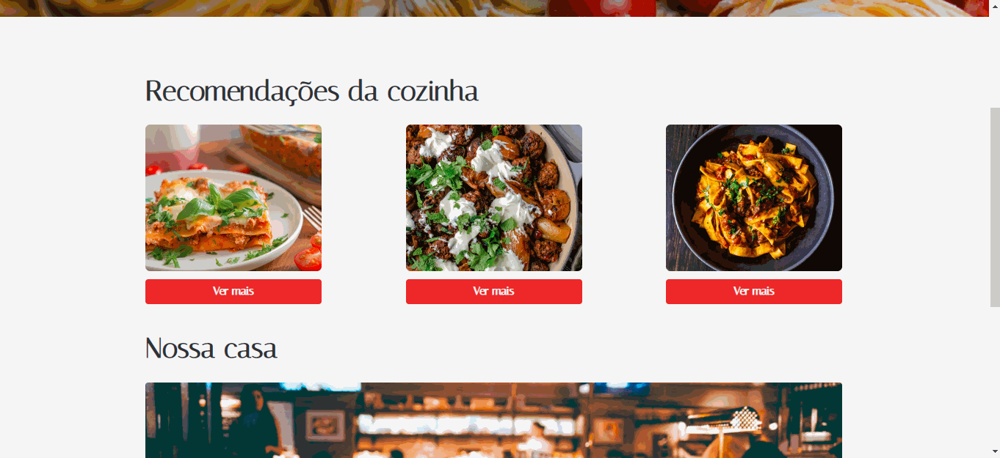
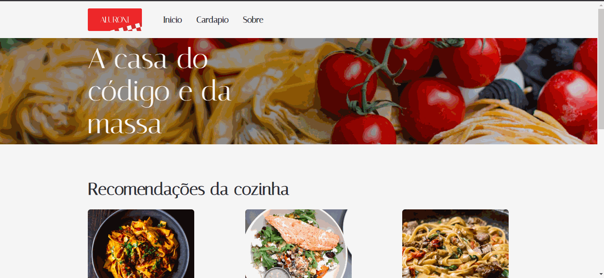

# Aluroni 

Esse projeto foi desenvolvido em React com Typescript. Ele simula um restaurante com os pratos e os cardapios. 

## Tela Inicial

Ao abrir a aplicação o usuário se depara com essa página. Onde ele pode visualizar os pratos recomendados pela cozinha, 
que mudam a cada vez que o usuario abre a pagina. Cada um dos pratos possui um botão de "ver mais", onde ao clicar, o usuário é encaminhado para a página onde ela vê detalhes de um prato específico.

### WEB 

## Tela de um prato especifico 

Ao clicar no botão de "ver mais", o usuario é encaminhado para a tela de detalhes de um prato específico. 

### WEB 

## Tela de Cardapio

Na tela de cardapio o usuario pode visualizar todos os pratos que ha no restaurante. Você pode clicar em cada um dos pratos. 
Pode usar a barra de busca para buscar por pratos. Ou filtrar mudando a opção que está no dropdown list (ordenar por), ou 
selecionar pelo tipo de prato para fazer a filtragem (massas, carnes, combos, veganos).

### WEB 

## Tela de Sobre

Ao clicar no botão de "SOBRE", o usuário é encaminhado para essa tela. Onde ele pode 
ver detalhes sobre o restaurante (ficticio). 

### WEB 

